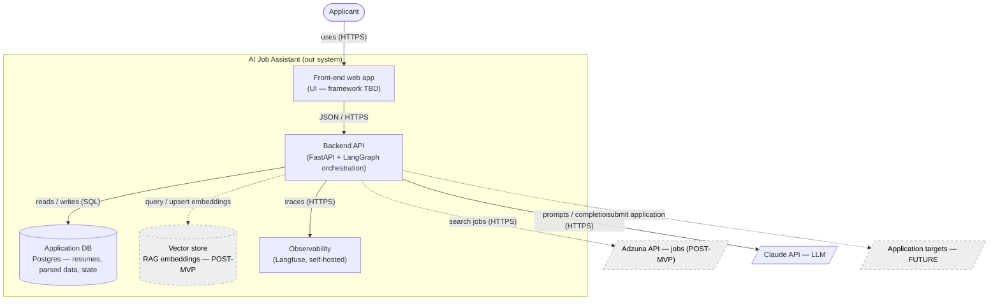

# Architecture diagram — AI Job Assistant

## What this is (C4 Level 2 — Containers)

This opens the black box from the context diagram and shows the **containers** —
the independently **deployable/runnable units** inside our system (apps and data
stores) — plus how they wire to each other and out to the external systems.

> ⚠️ **"Container" here is the C4 term, not a Docker container.** A C4 container is
> a separately runnable thing: a web app, an API service, a database, an
> observability stack. (We *happen* to run them with Docker — see ADR-0006 — but
> that's a deployment detail, not what "container" means at this level.)

This is a **structural** view (mirror of the behavioral flow diagram). The pieces
*inside* the backend (resume parser, `JobSource` adapter, LangGraph orchestrator)
are **components** — C4 Level 3 — and will be detailed later.

Scope is marked to match the PRD: solid = needed for the MVP; **dotted = Post-MVP /
Future**.

## Legend

- `([ ])` = actor · `[ ]` = container (app/service) · `[( )]` = data store ·
  `[/ /]` = external system.
- Solid = MVP. **Dotted = Post-MVP / Future.**
- Arrow labels show the data + protocol.

## Containers

| Container | Responsibility | Scope | ADR |
|---|---|---|---|
| **Front-end web app** | UI the applicant uses (upload resume, review parse, later: pick jobs, approve docs) | MVP (minimal, **separate app**) | ADR-0008 (framework TBD) |
| **Backend API (FastAPI)** | HTTP API; runs the pipeline (LangGraph in-process); calls Claude/Adzuna; persists data; emits traces | MVP | ADR-0002, ADR-0003 |
| **Application DB (Postgres)** | Stores uploaded resumes, parsed/structured data, jobs, run & approval state | MVP | ADR-0009 |
| **Vector store** | Embeddings for RAG (job/skill retrieval & matching) | Post-MVP | — (TBD) |
| **Observability (Langfuse)** | Receives traces of LLM calls & pipeline steps; self-hosted so PII stays local | MVP | ADR-0005 |

## Components inside the Backend (C4 L3 — preview)

Not drawn yet; the backend will contain at least:
- **Resume parser** — turns an uploaded file into structured data (MVP).
- **LangGraph orchestrator** — the staged, HITL pipeline (ADR-0003).
- **`JobSource` adapter** — pluggable; Adzuna is the first impl (ADR-0007), Post-MVP.
- **Eval hooks** — capture inputs/outputs for eval datasets via the traces.

## External systems (recap from context)

- **Claude API** — LLM (`claude-opus-4-8`, ADR-0004). Needed in MVP (parsing).
- **Adzuna API** — job listings (ADR-0007). Post-MVP (job search).
- **Application targets** — submission destinations. Future, human-gated.

## Open items / decisions still needed (candidate future ADRs)

- ~~Front-end approach (separate vs. folded into backend)?~~ **Resolved: separate
  front-end app, from the MVP (ADR-0008).** Specific framework still TBD.
- ~~Application database?~~ **Resolved: PostgreSQL (ADR-0009).**
- **Vector store** — which one (e.g. **pgvector** reusing Postgres vs. a dedicated
  vector DB)? → Post-MVP ADR.
- Whether **LangGraph state/checkpoints** live in the app DB or a separate store.