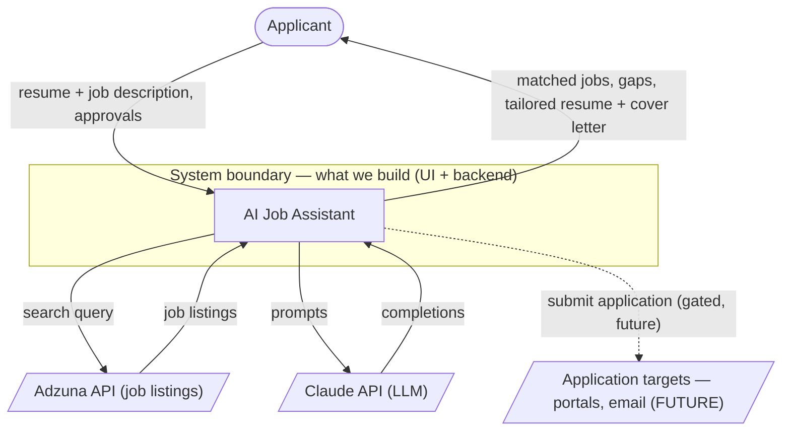

# Context diagram — AI Job Assistant

## What this is (C4 Level 1)

This is the **System Context** view — **C4 Level 1**, the most zoomed-out picture of
the system. A context diagram shows our system as a single **black box**, plus the
**people** who use it and the **external systems** it depends on, with labeled arrows
for what flows between them. It answers: *what is this system, who uses it, what does
it depend on, and where is the boundary between what we build and what we only call?*

It deliberately omits internals (front end, backend, LangGraph, Langfuse, databases).
Those are *containers* and appear at **C4 Level 2** — the architecture diagram.
**Rule of thumb:** if we **build & deploy** it, it's *inside* the box; if we only
**call** it, it's an *external* system outside the box.

> C4 is a widely-used convention for architecture diagrams (4 zoom levels: Context →
> Containers → Components → Code). See [c4model.com](https://c4model.com). This file
> is Level 1; the architecture diagram will be Level 2.

The four C4 levels — like zooming in on a map:

| Level | Name | Zoom | Shows | Audience |
|---|---|---|---|---|
| **1** (this file) | System Context | Whole world | Our system (1 box) + people + external systems | Everyone |
| 2 | Containers | Inside the system | Deployable/runnable units: front end, backend API, databases, etc. | Technical |
| 3 | Components | Inside one container | Modules/components within an app | Developers |
| 4 | Code | Inside one component | Classes/functions (rarely drawn) | Developers |

You only zoom in as far as is useful — most teams draw Levels 1 and 2, occasionally 3, almost never 4.

## Legend / conventions

- `([ ])` rounded = **actor** (a person).
- `[ ]` rectangle = **our system** (inside the boundary — includes the front end).
- `[/ /]` parallelogram = **external system** (a dependency we don't own).
- Solid arrow = current/MVP flow. **Dotted arrow** = future/deferred flow.
- Every arrow is **labeled** with what flows and the direction.

## Actors

- **Applicant** — the only actor in v1. Provides their resume and a target job
  description, and reviews/approves at the human-in-the-loop gates; receives matched
  jobs, gap analysis, and the tailored resume + cover letter. The applicant interacts
  with the system **through its front-end UI** (the UI is part of the system, not a
  separate box — see below).

## External systems

- **Adzuna API** — source of job listings (free dev tier, AU coverage). Accessed
  behind a pluggable `JobSource` interface (see ADR-0007), so swapping/adding
  sources later doesn't change this boundary.
- **Claude API** — the LLM (Anthropic, `claude-opus-4-8`; see ADR-0004) used for
  parsing, matching, gap analysis, and tailoring.
- **Application targets (FUTURE)** — job portals / email to which applications would
  be submitted. **Deferred and human-gated** (auto-apply is the last, riskiest
  phase; the exact mechanism is an open question in the PRD). Shown dotted to mark it
  as not-in-MVP.

## Deliberately NOT shown (and why)

- **Front end / UI** — the web UI the applicant uses is **part of** the AI Job
  Assistant (we build and deploy it), so it's *inside* the black box, not an external
  entity. At context level the applicant talks to the system as a whole; the front end
  appears as a **component in the architecture diagram** (C4 Level 2).
- **Langfuse / observability** — our *own* self-hosted infrastructure, inside the
  boundary, not an external dependency. Internal tooling doesn't appear at context level.
- **FastAPI, LangGraph, vector store, databases** — internal components; they live in
  the **architecture diagram**, not here.

> Rule of thumb: if we **build and deploy** it (front end, backend, observability),
> it's *inside* the box at context level. If we only **call** it (Adzuna, Claude),
> it's an *external* system outside the box.

## Notes / open items to review

- Confirm the v1 actor set is just the Applicant (no admin/operator yet).
- "Application targets" is intentionally vague pending the auto-apply mechanism
  decision (PRD §7 open question).