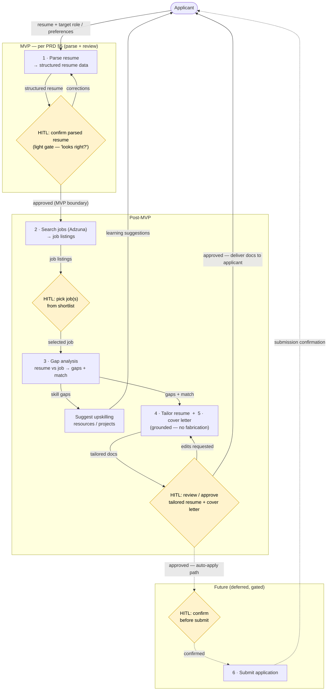

# Flow diagram — AI Job Assistant

## What this is

A **flow diagram** is a *behavioral* view: it shows the **sequence** of stages the
system moves through, drawn as **input → output**, with the **human-in-the-loop
(HITL) gates** marked. It complements the context/architecture diagrams (which show
*structure*) — this one shows *what happens, in what order, and where the human
approves*.

**Scope is grouped into tiers** to stay consistent with the PRD: **MVP** (the thin
slice the PRD §5 defines), **Post-MVP** (the later stages), and **Future**
(deferred/gated). The PRD is the source of truth for scope; if the MVP boundary
should change, change the PRD first, then this diagram.

Conventions: rectangles = stages; **diamonds = HITL gates** (yellow); subgraphs =
scope tiers; solid arrows = current/near-term flow; **dotted = future/deferred**;
arrow labels = the data flowing.

## Stages (mapped to the PRD)

| # | Stage | Input → Output | HITL gate | Scope |
|---|---|---|---|---|
| 1 | Parse resume | resume file → structured resume data | review/correct parse | **MVP** |
| 2 | Search jobs | role/prefs (+ resume) → job listings (Adzuna) | pick job(s) | Post-MVP |
| 3 | Gap analysis | resume + selected job → skill gaps + match score | — | Post-MVP |
| – | Upskilling suggestions | skill gaps → resources/projects | — | Post-MVP |
| 4 | Tailor resume | resume + job + gaps → tailored resume | review/approve | Post-MVP |
| 5 | Cover letter | resume + job → tailored cover letter | review/approve (same gate) | Post-MVP |
| 6 | Submit application | approved docs → submission | confirm before submit | **Future** |

## Scope tiers

- **MVP (per PRD §5):** upload → parse → review/correct. The whole path is
  traced/observable and parse quality is measured by an eval set. Nothing past the
  "approved (MVP boundary)" arrow ships in the MVP.
- **Post-MVP:** search, gap analysis, **upskilling suggestions**, tailoring, and the
  cover letter. (Upskilling suggestions are confirmed **post-MVP**.) The MVP-era
  output is just the structured resume; the tailored docs ("deliver docs to
  applicant") arrive in this tier.
- **Future (deferred, gated):** auto-apply (stage 6) — always human-confirmed and
  ToS-aware; the riskiest piece, last.

## Iteration (not a straight line)

The pipeline loops, it isn't pure waterfall:
- parse → *corrections* → parse (fix a bad parse)
- tailor → *edits requested* → tailor (refine the docs)
- the user can return to **pick** a different job and re-run gap/tailor.

## Notes / open items to review

- ~~Parse-review gate: full editor vs. lightweight confirm for MVP?~~
  **Resolved: light gate for MVP (summary + "looks right? Yes/Fix"); full
  field-by-field editor deferred to Post-MVP.**
- ~~Should gap analysis run for every shortlisted job, or only the picked one?~~
  **Resolved: only the selected job (per-job), to control cost.**
- ~~Upskilling suggestions: MVP or later?~~ **Resolved: Post-MVP.**